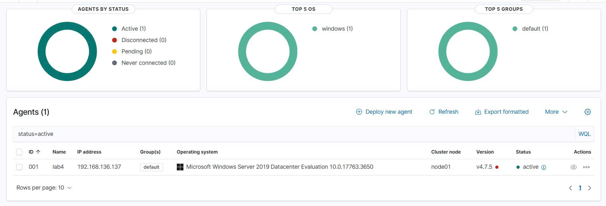
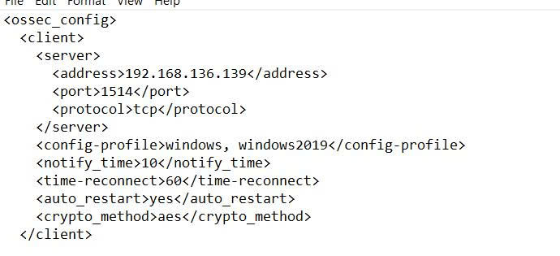
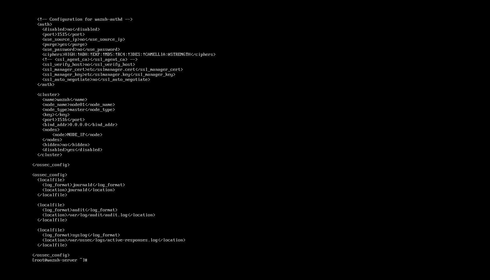
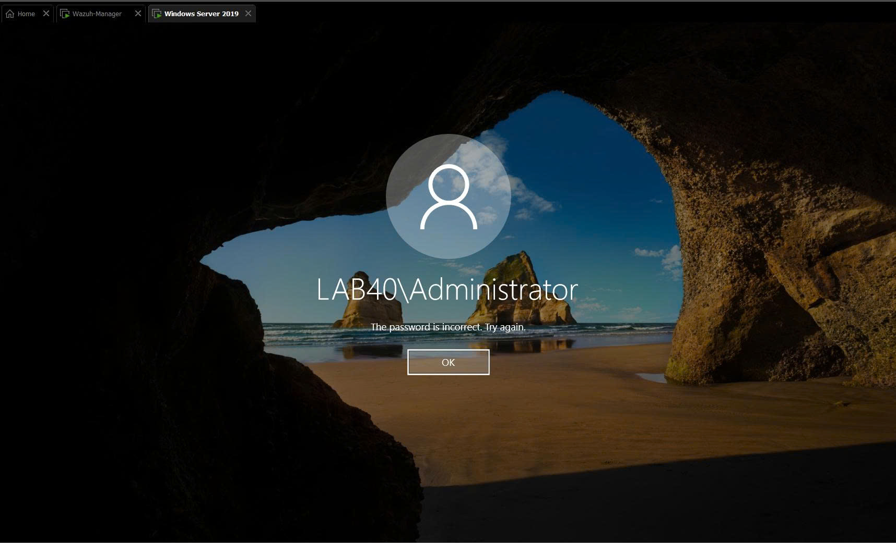
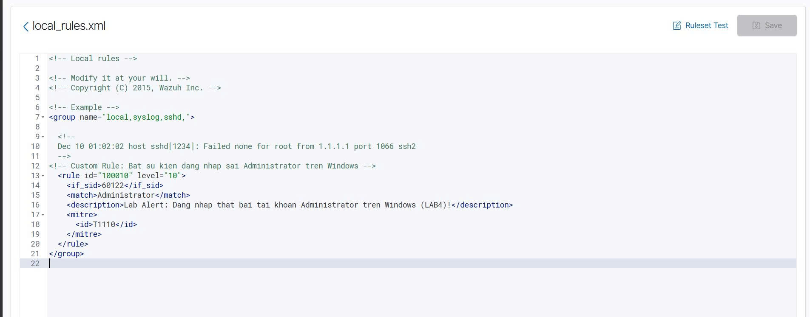
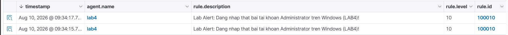

# 🛡️ Homelab Wazuh SIEM: Custom Rule Detection for Failed Windows Administrator Logons

## Vai trò
- Cá nhân (100% tự triển khai)

## Mục tiêu
Dự án nhằm xây dựng hệ thống giám sát an ninh tập trung (SIEM) bằng Wazuh để tự động thu thập log và phát hiện thời gian thực các hành vi tấn công dò quét/đăng nhập trái phép (Brute Force) vào tài khoản quản trị cao cấp (`Administrator`) trên hệ thống Windows Server 2019.

## Công nghệ sử dụng
- **SIEM Platform**: Wazuh Manager v4.7.x (Linux VM - IP `192.168.136.139`)
- **Target Endpoint**: Windows Server 2019 (Node `lab4` - IP `192.168.136.137`)
- **Agent**: Wazuh Agent v4.7.5
- **Threat Mapping**: MITRE ATT&CK Framework (Kỹ thuật T1110 - Brute Force)
- **Log Source**: Windows Security Event Channel (`Event ID 4625` - Logon Failure)

## Quá trình thực hiện
1. **Triển khai Agent & Cấu hình kênh Log**: Cài đặt Wazuh Agent v4.7.5 trên Windows Server 2019, kết nối an toàn về Manager qua port `1514/TCP` và cấu hình file `ossec.conf` thu thập log kênh `Security` (`eventchannel`).
2. **Viết Custom Detection Rule**: Khai báo quy tắc tùy chỉnh (`Rule ID 100010`, Level 10) trong file `/var/ossec/etc/rules/local_rules.xml` trên Manager nhằm lọc các sự kiện `Event ID 4625` khớp giá trị Target User là `Administrator` và ánh xạ chuẩn MITRE ATT&CK T1110.
3. **Mô phỏng Tấn công & Xác minh Cảnh báo**: Thực hiện thao tác cố tình đăng nhập sai mật khẩu nhiều lần tài khoản `LAB40\Administrator` trên Windows Server để kiểm thử luồng log nổ cảnh báo real-time trên Wazuh Dashboard.

## Kết quả / Minh chứng

*Hình 1: Trạng thái Agent `lab4` (IP `192.168.136.137`) hiển thị Active trên Wazuh Dashboard.*

*Hình 2: Cấu hình địa chỉ Wazuh Manager `192.168.136.139` qua port `1514` trên Agent.*

*Hình 3: Cấu hình hệ thống và các đường dẫn thu thập log trên Wazuh Manager.*

*Hình 4: Thực hiện hành vi kích hoạt log bằng cách nhập sai mật khẩu tài khoản `LAB40\Administrator`.*

*Hình 5: Khai báo Custom Rule ID 100010 trong file `local_rules.xml` ánh xạ chuẩn MITRE ATT&CK T1110.*

*Hình 6: Cảnh báo Level 10 nổ real-time trên giao diện Wazuh Dashboard khi phát hiện đăng nhập thất bại.*

## Bài học rút ra
Hiểu rõ cơ chế thu thập, chuẩn hóa log của hệ thống SIEM và nắm vững phương pháp viết Custom Rule lọc sự kiện đặc thù dựa trên Event ID kết hợp ánh xạ khung phòng thủ MITRE ATT&CK. Giới hạn của giải pháp hiện tại mới dừng ở mức nhận diện/cảnh báo (Detection), chưa tự động kích hoạt kịch bản chặn IP/khóa tài khoản (Active Response/SOAR).

## Lưu ý
Dự án cá nhân do tôi tự nghiên cứu, dựng môi trường Lab, cấu hình hệ thống, viết Rule XML và thực hiện kiểm thử thực tế.