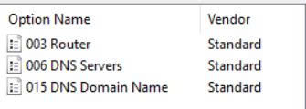
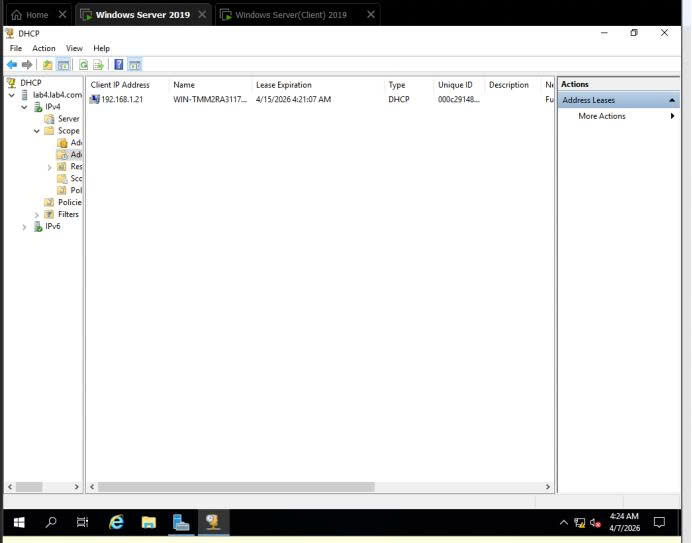
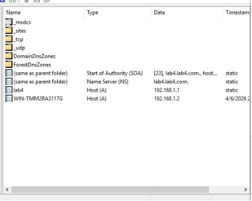

<<<<<<< HEAD
# Triển khai & Bảo mật Dịch vụ DNS và DHCP trên Windows Server

Thực hành cấu hình, triển khai và bảo mật hệ thống mạng cho các dịch vụ cốt lõi (DNS, DHCP) trong môi trường Windows Server và Windows Client.

---

## 1. Bảo mật DNS (Zone Transfer & Dynamic Update)

- **Zone Transfer Security**: Thiết lập chế độ *Allow zone transfers -> Only to the following servers* (hoặc *Name Servers*) để hạn chế việc đối tượng không xác định thực hiện truy vấn lấy toàn bộ dữ liệu Zone.
- **Dynamic Update**: Chỉnh sửa sang *Secure only* nhằm đảm bảo chỉ các máy tính đã gia nhập Domain (`lab4.lab4.com`) mới có quyền cập nhật bản ghi động.

| Cấu hình Zone Transfer | Cấu hình Dynamic Update |
| :---: | :---: |
|  |  |

---

## 2. Triển khai & Bảo mật DHCP (Scope Options & Reservation)

- **DHCP Scope Options**: Cấp phát tự động các thông số mạng cho Client gồm Gateway (`003 Router`), `006 DNS Servers` và `015 DNS Domain Name` (`lab4.com`).
- **Reservation**: Thiết lập gán cố định địa chỉ IP (`192.168.1.22`) cho thiết bị theo MAC Address.

| DHCP Scope Options | DHCP Reservation |
| :---: | :---: |
|  |  |

---

## 3. Kiểm thử trên Client & Console Quản trị

- **Client Verification**: Chạy `ipconfig /renew` trên PowerShell/CMD của Client để kiểm tra việc cấp phát IP thành công từ DHCP Server theo đúng Reservation (`192.168.1.22`).
- **Management Consoles**: Đảm bảo thông tin cấp phát khớp giữa *DHCP Address Leases* và các bản ghi Host (A) tương ứng trên *DNS Console*.

### Kiểm thử trên Client (`ipconfig /renew`)

### Quản trị Dịch vụ (Consoles)
| DHCP Console (Address Leases) | DNS Console (A Records) |
| :---: | :---: |
|  |  |
=======
# 🛡️ Hồ Gia Bảo — SOC Analyst Portfolio

Chào bạn! Tôi là **Hồ Gia Bảo**, định hướng trở thành **SOC Analyst / Security Engineer**. Portfolio này tổng hợp các dự án Homelab cá nhân và các đồ án môn học chuyên ngành An toàn thông tin / Mạng máy tính mà tôi đã thực hiện.

Mục tiêu chính của tôi là nghiên cứu, thiết lập hệ thống giám sát an toàn thông tin (SIEM/Wazuh), xây dựng Custom Detection Rules (nhận diện Brute Force, Malicious Activity) và phân tích log chuyên sâu.

---

## 🛠️ Kỹ năng & Công nghệ chính

- **SIEM & Monitoring**: Wazuh SIEM, Windows Event Logs (EventChannel), Sysmon.
- **System & Security Admin**: Windows Server (Active Directory, DNS, DHCP, GPO), Linux (Ubuntu, CentOS), AppArmor.
- **Rule Engineering & Threat Detection**: Custom XML Rules, MITRE ATT&CK Mapping (T1110), WAF Configuration.
- **Scripting & Automation**: Bash Shell, PowerShell, Python.
- **Networking & Protocols**: TCP/IP, NAT, ACL, Network Traffic Analysis.

---

## 📂 Danh mục Dự án (Projects Overview)

### 1. [Homelab Wazuh SIEM — Detection Engineering](./homelab-wazuh-siem/) *(Dự án cá nhân)*
- **Mô tả ngắn**: Xây dựng hệ thống giám sát tập trung Wazuh SIEM, viết Custom Rules (XML) phát hiện tấn công Brute Force tài khoản Administrator trên Windows Server 2019 theo chuẩn MITRE ATT&CK (T1110).
- **Công nghệ**: Wazuh Manager, Wazuh Agent, Windows Server 2019, MITRE ATT&CK.

### 2. [Windows Server DNS & DHCP Infrastructure](./dns-dhcp-windows-server/) *(Đồ án môn học)*
- **Mô tả ngắn**: Triển khai và cấu hình hạ tầng dịch vụ mạng cốt lõi DNS (Zone Transfer, Dynamic Update) và DHCP (Scope, Reservation, Failover) trên môi trường Windows Server.
- **Vai trò**: Phụ trách phần dựng cấu hình chi tiết dịch vụ Windows Server (W2).

### 3. [WAF Configuration & SQL Injection Protection](./waf-sql-injection/) *(Đồ án nhóm)*
- **Mô tả ngắn**: Phân tích cơ chế tấn công SQL Injection, thiết lập và tối ưu hóa luật bộ lọc WAF để chặn các payload độc hại trên mô hình ứng dụng 3 lớp (3-tier).
- **Vai trò**: Trực tiếp phân tích và viết báo cáo các mục 1.1, 2.1, 2.4, 3.1.

### 4. [Mandatory Access Control with AppArmor](./linux-mac-apparmor/) *(Đồ án nhóm)*
- **Mô tả ngắn**: Nghiên cứu và thực hành cơ chế kiểm soát truy cập bắt buộc (MAC) trên hệ thống Linux/macOS sử dụng AppArmor nhằm cô lập ứng dụng và hạn chế leo thang quyền hạn.
- **Vai trò**: Phụ trách phần cấu hình và xử lý lỗi (troubleshooting) mục 1.3, 1.4.

---

## 📄 Thông tin liên hệ
- **Email**: hogiabao17102005@gmail.com
- **GitHub**: [github.com/Kiavubao](https://github.com/Kiavubao)

---
*Lưu ý: Đối với các đồ án thực hiện theo nhóm, nội dung trong từng folder ghi rõ chính xác phần tôi phụ trách nhằm đảm bảo tính trung thực và tôn trọng bản quyền của các thành viên.*
>>>>>>> d7fd1dc9058dc0e4249025752e2be79dd142c5ed
