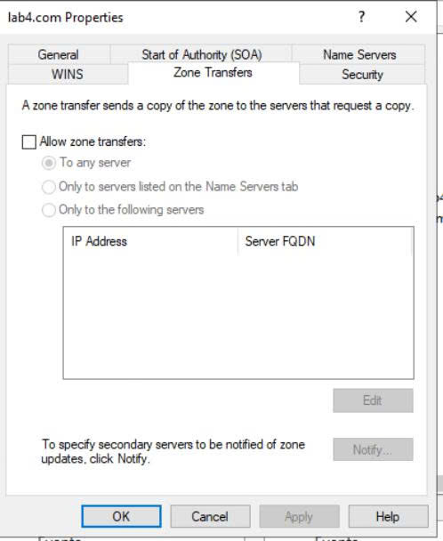
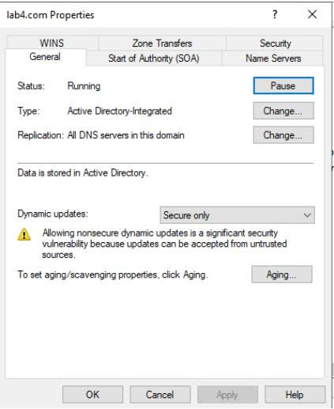
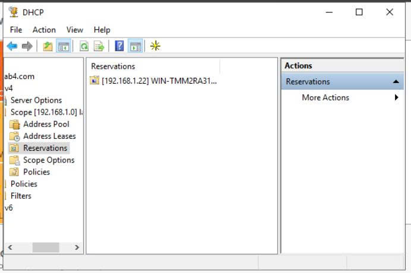
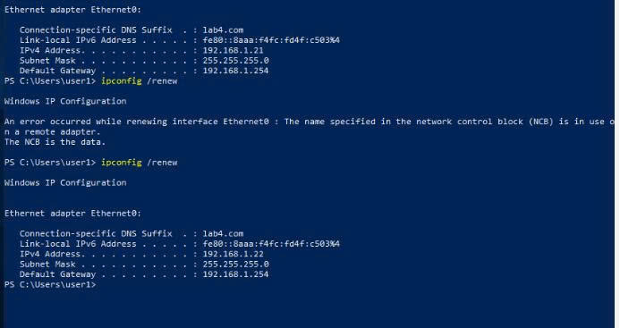

# 🛡️ Triển Khai & Bảo Mật Dịch Vụ DNS & DHCP Trên Windows Server

## Vai trò
- Đồ án nhóm (Phần tôi phụ trách: Triển khai dịch vụ DNS, cấu hình Zone Transfer, Dynamic Update và thiết lập DHCP Scope, Reservation).

## Mục tiêu
Tự động hóa việc cấp phát địa chỉ IP và quản lý phân giải tên miền tập trung trong hạ tầng Active Directory, đồng thời cấu hình cơ chế bảo mật cho quá trình cập nhật và truyền dữ liệu Zone.

## Công nghệ sử dụng
- Windows Server (DNS Server & DHCP Server Roles)
- Active Directory Domain Services (AD DS)
- Windows Client (Windows 10/11)
- CLI / Network Tools (ipconfig, nslookup, dnscmd)

## Quá trình thực hiện
1. **Cấu hình DHCP Scope & Reservation:** Tạo Scope cấp phát IP tự động, thiết lập Router/DNS Option và cấu hình IP Reservation (gán IP cố định theo MAC) cho các thiết bị quan trọng.
2. **Triển khai DNS Forward/Reverse Zones & Secure Dynamic Update:** Khởi tạo Primary Zone (Lookup Zones), bật tính năng Secure Dynamic Update để chỉ cho phép các máy tính đã gia nhập Domain đăng ký bản ghi DNS.
3. **Cấu hình Bảo mật Zone Transfer & Kiểm thử:** Giới hạn phân quyền truyền dữ liệu Zone Transfer (chỉ cho phép các Name Server chỉ định), thực thi lệnh `ipconfig /registerdns` và kiểm tra phân giải ngược bằng `nslookup`.

## Kết quả / Minh chứng

*Hình 1: Phân quyền Zone Transfer chỉ cho phép các Name Server chỉ định để ngăn rò rỉ cấu hình mạng.*

*Hình 2: Thiết lập chế độ Secure Dynamic Update chỉ cho phép máy tính trong Domain đăng ký bản ghi DNS.*

*Hình 3: Thiết lập các tùy chọn Router (Default Gateway), DNS Server và Domain Name cho Client.*

*Hình 4: Thiết lập gán IP cố định dựa trên địa chỉ MAC của thiết bị.*

*Hình 5: Kiểm tra Client nhận IP thành công từ DHCP và thực thi lệnh nslookup kiểm tra phân giải tên miền.*

*Hình 6: Tổng quan cấu hình DHCP Server, Lease Range và danh sách Client đang nhận IP.*

*Hình 7: Danh sách các bản ghi DNS (A record, PTR record) trong Forward/Reverse Lookup Zones.*

## Bài học rút ra
Hiểu rõ mối liên kết giữa DHCP và Dynamic DNS trong môi trường Windows Server; nắm vững tầm quan trọng của việc siết chặt quyền Zone Transfer nhằm ngăn ngừa nguy cơ rò rỉ cấu hình sơ đồ mạng (Reconnaissance Attack).

## Lưu ý
Đây là đồ án học phần thực hiện theo nhóm.
Phần tôi trực tiếp phụ trách: Thiết lập DHCP Scope/Reservation, cấu hình DNS Zones, Secure Dynamic Update và phân quyền bảo mật Zone Transfer.